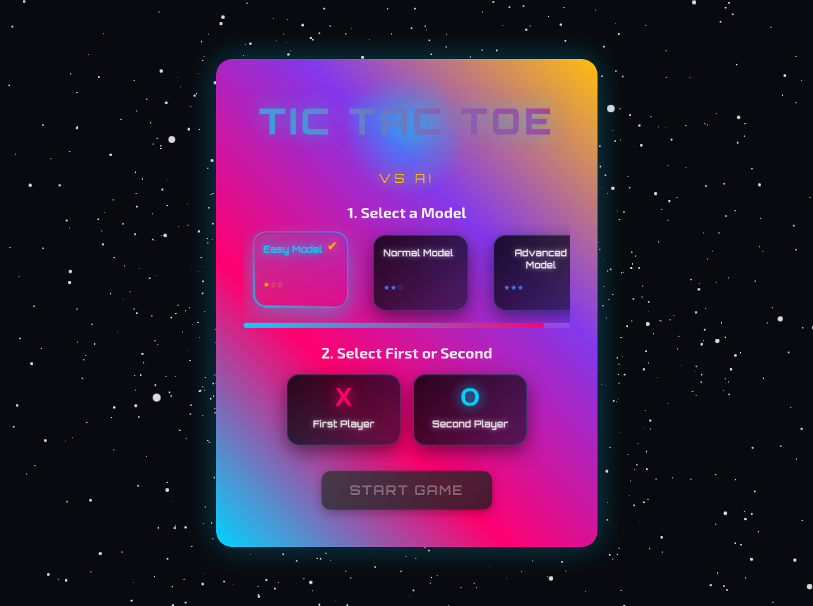
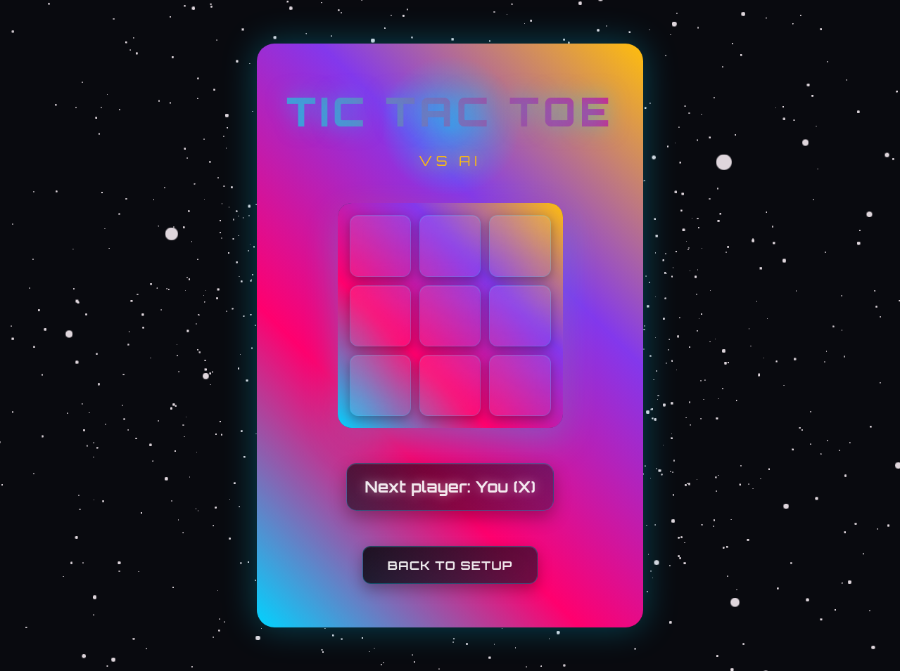
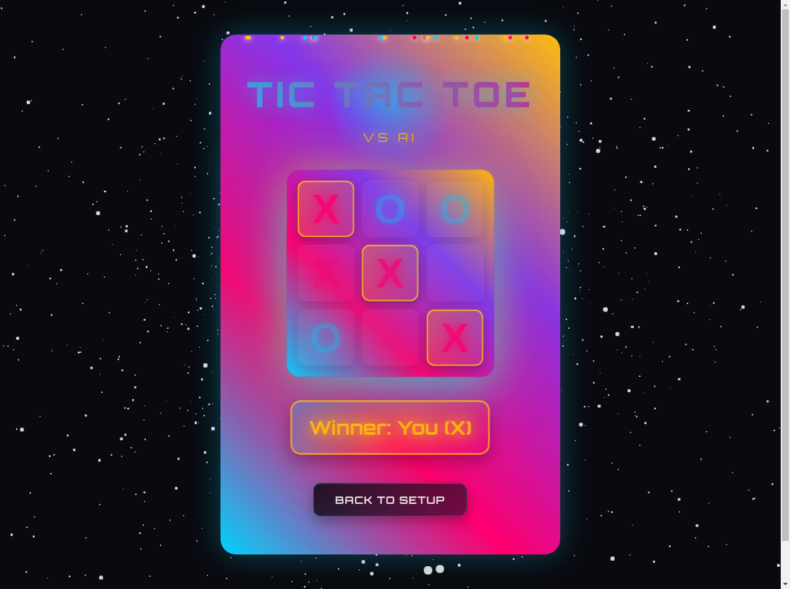

# Tic Tac Toe vs AI

A colorful and engaging Tic Tac Toe game where you can challenge an AI opponent trained with reinforcement learning.

## 🎮 Play Now

[**Play Tic Tac Toe vs AI**](https://Pied-Piper46.github.io/tic-tac-toe-rl)

## ✨ Features

- **Space-themed Gradient UI**: Enjoy playing on a visually appealing interface with vibrant colors and a space-themed background
- **Three Difficulty Levels**: Choose from Easy, Normal, or Advanced AI opponents
- **Player Choice**: Play as X (first player) or O (second player)
- **Reinforcement Learning AI**: Challenge an AI opponent that has learned optimal strategies through reinforcement learning

## 🖼️ Gameplay

The game follows classic Tic Tac Toe rules - be the first to get three of your marks in a row (horizontally, vertically, or diagonally).

1. Select your preferred AI difficulty level
2. Choose to play as X (first) or O (second)
3. Click "Start Game" to begin

4. Take turns placing your mark on the board

5. The game will announce the winner or declare a draw

## 🛠️ Technologies Used

- React.js
- CSS for the gradient effects and animations
- Reinforcement learning algorithms for AI opponent

## 🔮 Future Enhancements

- Additional AI training methods
- Multiplayer mode
- Customizable board sizes
- Game statistics tracking
- Mobile app version

## 📝 License

This project is open source and available under the MIT License.

---

Enjoy the game and see if you can outsmart the AI! Feedback and contributions are always welcome.
