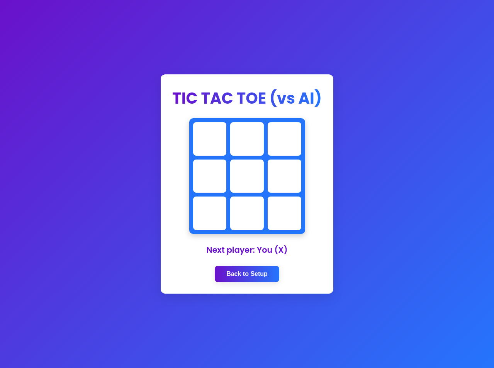
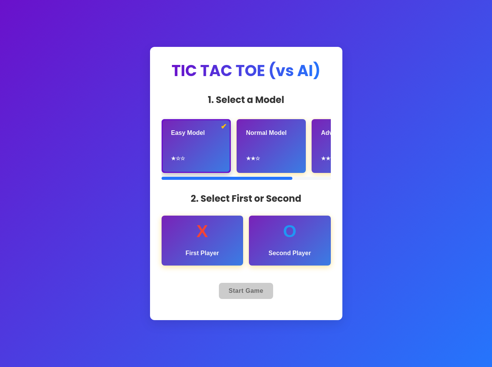
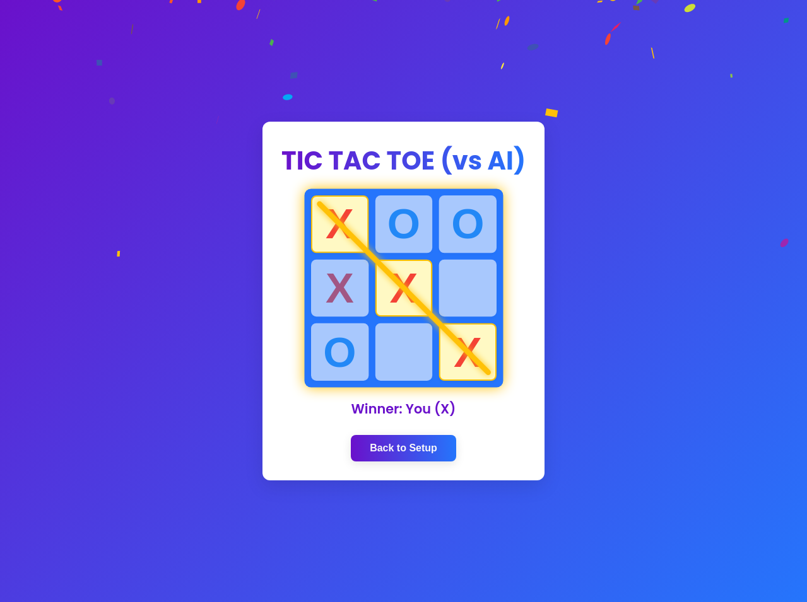

# Tic Tac Toe vs AI



A modern, interactive Tic Tac Toe game where you can challenge an AI opponent trained through reinforcement learning. Test your skills against different difficulty levels and see if you can outsmart the AI!

## 🎮 Play Now

[**Play Tic Tac Toe vs AI**](https://Pied-Piper46.github.io/tic-tac-toe-rl)

## ✨ Features

- **Reinforcement Learning AI**: Challenge an AI opponent trained using Q-learning algorithms
- **Multiple Difficulty Levels**: Choose from Easy, Normal, or Advanced AI models
- **Responsive Design**: Enjoy smooth gameplay on any device
- **Real-time Feedback**: Clear visual indicators show game progress and results
- **Confetti Celebration**: Experience a delightful celebration when you win

## 🤖 About the AI

This game features an AI opponent trained through reinforcement learning, specifically using the Q-learning algorithm. The AI learns optimal moves by playing thousands of games against itself and building a Q-table that maps game states to move values.

### How the AI Works

The reinforcement learning process involves:

1. **State Representation**: Each board configuration is represented as a unique state
2. **Q-Table**: Stores the expected reward for each possible action in each state
3. **Exploration vs. Exploitation**: The AI balances trying new moves and using known good moves
4. **Reward System**: Wins are rewarded, losses are penalized, and draws have neutral value
5. **Learning Rate**: The AI gradually improves its strategy through continuous training

The game includes three pre-trained models with different skill levels, allowing players to enjoy matches appropriate to their experience.

## 🖼️ Game Screenshots

### Initial Setup Screen


### Gameplay


### Victory Celebration


## 🛠️ Technology Stack

- **Frontend**: React.js with CSS transitions for smooth animations
- **AI Backend**: Python-based reinforcement learning implementation
- **State Management**: React hooks for efficient state handling
- **Deployment**: GitHub Pages for easy access

## 🧠 Reinforcement Learning Details

The AI opponent uses a Q-learning approach, a type of model-free reinforcement learning algorithm. The implementation includes:

- **Q-Table**: A mapping of state-action pairs to expected rewards
- **Learning Rate (α)**: Controls how quickly the AI adapts to new information
- **Discount Factor (γ)**: Balances immediate vs. future rewards
- **Exploration Rate (ε)**: Controls the balance between trying new strategies and using known good ones

The Q-learning agent improves over time by updating its Q-values according to the formula:

```
Q(s,a) = Q(s,a) + α * (r + γ * max(Q(s',a')) - Q(s,a))
```

Where:
- s is the current state
- a is the action taken
- r is the reward received
- s' is the new state
- a' represents all possible actions in the new state

## 🎯 How to Play

1. Select a difficulty level (Easy, Normal, or Advanced)
2. Choose whether to play as the first player (X) or second player (O)
3. Click "Start Game" to begin
4. Take turns placing your mark in empty cells
5. The first player to get three marks in a row (horizontally, vertically, or diagonally) wins
6. If all cells are filled without a winner, the game ends in a draw

## 🔮 Future Enhancements

- Additional AI training methods
- Multiplayer mode
- Customizable board sizes
- Game statistics tracking
- Mobile app version

## 📝 License

This project is open source and available under the MIT License.

---

Enjoy the game and see if you can outsmart the AI! Feedback and contributions are always welcome.
